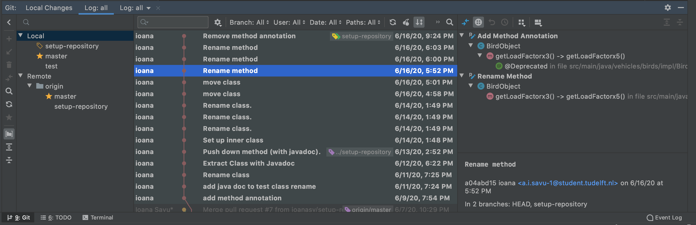
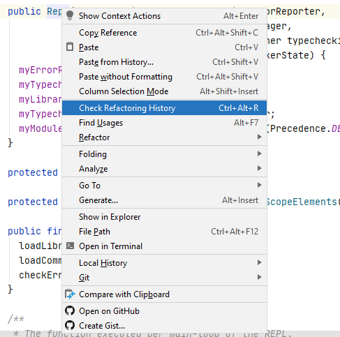
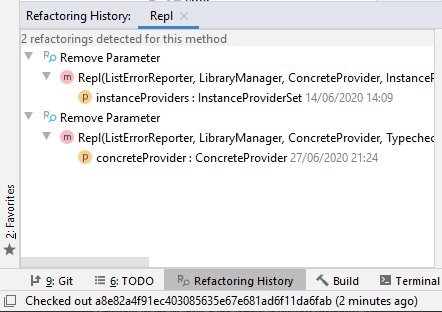
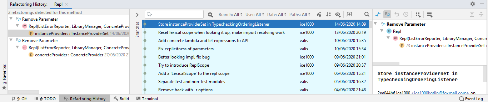
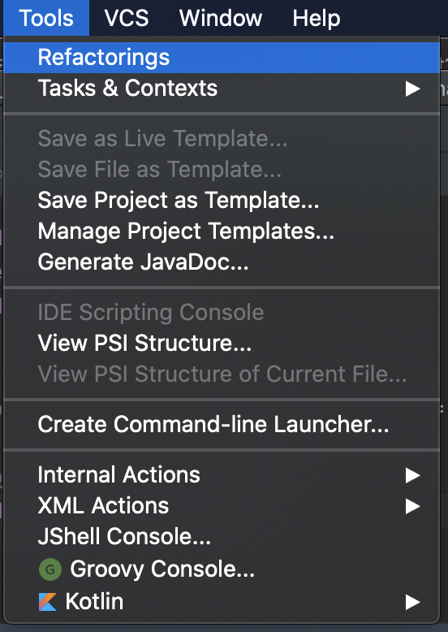

# RefactorInsight

This project aims to introduce a RefactorInsight, a plugin for IntelliJ IDEA that detects code refactorings in the version control history of Java repositories. 
The main framework that is used in order to retrieve the refactorings is the RefactoringMiner API.

Every sprint planning and retrospective can be found in the [Milestones section](https://gitlab.ewi.tudelft.nl/cse2000-software-project/2019-2020-q4/cluster-0/detecting-refactorings-in-code-changes/detecting-refactorings-in-code-changes/-/milestones?sort=due_date_desc&state=all). 

The CI/CD pipelines have 3 stages: build, validate and coverage.

In the `build` stage, the project and its dependencies are built. This is followed by the `validation` stage where 
`checkstyle`, and `test` jobs are run. Finally, the `coverage` is calculated for the entire project,
excluding the package `ui.windows`. The reason is that the ui objects cannot be tested, since they have many dependencies
that cannot be mocked.

If any stage fails, the badge will turn red.

How to build & run
-------------

#### Clone and build

Download or clone the project in IntelliJ IDEA 2020.1.2 or up and run `gradle build` in order to install all the required dependencies.
Use `gradle runIde` task to run the project. 
A new IDE will open up where you can follow the steps presented below.

#### Import from disk 

[Download RefactorInsight](https://gitlab.ewi.tudelft.nl/cse2000-software-project/2019-2020-q4/cluster-0/detecting-refactorings-in-code-changes/detecting-refactorings-in-code-changes/-/jobs/artifacts/85-improve-documentation/raw/build/distributions/detecting-refactorings-in-code-changes-1.0-SNAPSHOT.zip?job=build)

If you want to import the plugin from disk, click `Download RefactorInsight`.
Go to IntelliJ -> Preferences -> Plugin -> Install Plugin
from Disk and upload the zip file. After an IDE restart, you will be able to follow the steps below.

#### How to use

In order to see the refactorings in a git repository, make sure you cloned the repository and 
open the built-in Git tab. On the right side, you will see a button as highlighted below.

Click on a commit and then on the Show Refactorings button presented above to see the refactorings detected at that commit. 
This should look as below.

In order to see the refactoring history of a method, class or attribute,
 right-click on the object's signature as below.

Click on 'Check Refactoring History' in order to see the refactorings history.
An example for a class `LuxuryCar` is presented below.

If you double-click on a leaf node in a tree, the VCS log opens at that specific commit.

In the main Tools menu, you can select Mine All Refactorings if the commits have not been mined.

