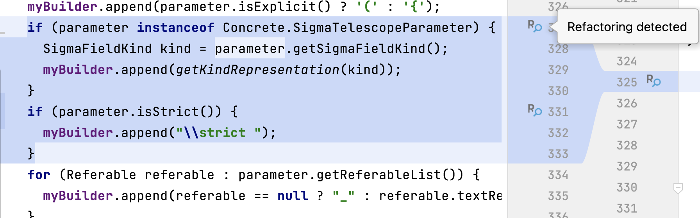
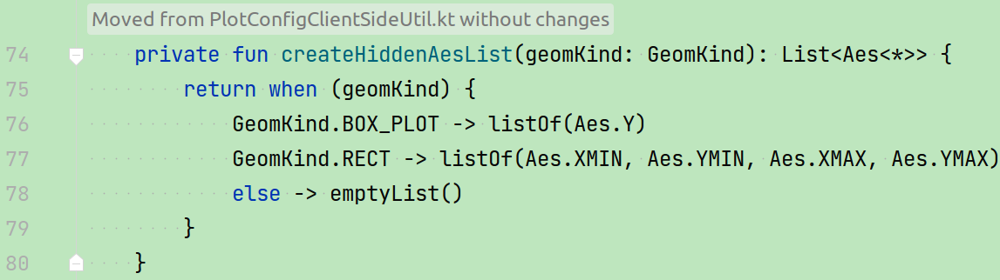
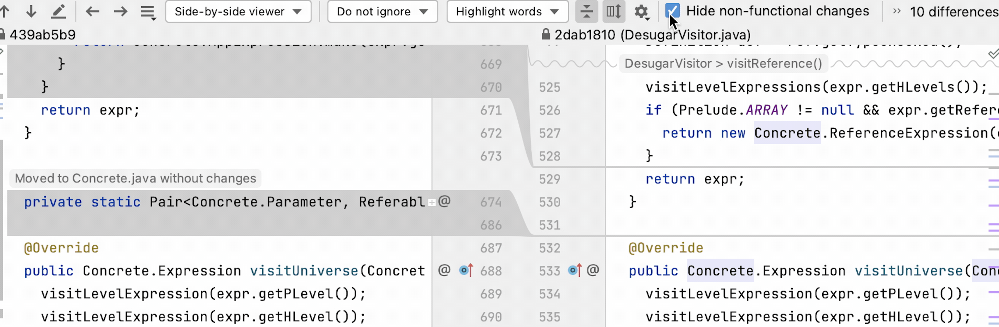
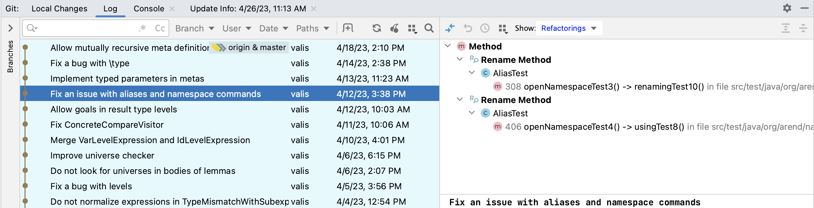
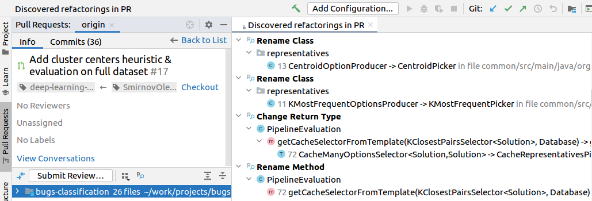
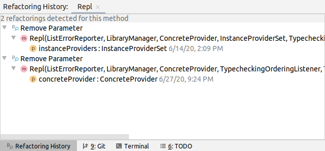

[](https://research.jetbrains.org/)
[](https://opensource.org/licenses/MIT)
[](https://github.com/JetBrains-Research/refactorinsight/badges/master)
[](https://plugins.jetbrains.com/plugin/14704-refactorinsight)


### RefactorInsight Plugin

RefactorInsight is a plugin for IntelliJ IDEA that enhances the representation of code changes with refactoring information in Java and Kotlin projects.

RefactorInsight relies on [RefactoringMiner](https://github.com/tsantalis/RefactoringMiner) and [kotlinRMiner](https://github.com/JetBrains-Research/kotlinRMiner) for retrieval of refactorings.

The plugin is compatible with IntelliJ IDEA 2023.1 and is [available for free](https://plugins.jetbrains.com/plugin/14704-refactorinsight) on JetBrains Marketplace.

### Table of contents
* [Features](#features)
  * [Smart Diff](#smart-diff)
  * [Hide non-functional changes](#hide-non-functional-changes)
  * [Refactorings in commits](#refactorings-in-commits)
  * [Refactorings in pull requests](#refactorings-in-pull-requests)
  * [Refactoring history of an object](#refactoring-history-of-an-object)
* [Build instructions](#build-instructions)
* [Contribution and feedback](#contribution-and-feedback)
* [Citing RefactorInsight](#citing-refactorinsight)

### Features
#### Smart diff
RefactorInsight labels code diffs with information about performed refactorings.
It shows  close to refactoring changes
and opens the corresponding code diff by click.



To make reviewing bug fixes or new features easier, the plugin auto folds refactorings in code diffs and shows hints with short descriptions of each refactoring.
Currently, it works for the following refactoring types: `Move Method`, `Pull Up/Push Down Method`, `Extract Method`, and `Inline Method`.



#### Hide non-functional changes
RefactorInsight provides a possibility to collapse refactoring changes in code diffs allowing users to focus on functional changes.

To hide non-functional changes (refactorings) in the code diff, check the corresponding checkbox in the diff window settings.



#### Refactorings in commits
To see refactorings in your Git repository, go to the **Git/Log** tab in IntelliJ IDEA and choose `Refactorings` in the drop-down list next to `Show`.



#### Refactorings in pull requests
To see the refactorings in a specific pull request, go to the **Pull Requests** tab in IntelliJ IDEA, select any pull request and click .



#### Refactoring history of an object
To see the refactoring history of a method, class, or attribute, right-click the object's signature and select **Check Refactoring History**. Here is an example for a method named `Repl`:



Double-click a leaf node in the tree to open the VCS log at that specific commit and see a list of detected refactorings in that commit.

#### Settings
By default, for performance reasons, refactorings are only retrieved from the last 100 commits in the project history. This number can be adjusted in the plugin's settings. Alternatively, you can use **Mine All Refactorings** on the **Tools** menu to go through _all_ commits in the history of your project.
The plugin also keeps track of new commits and processes them.

### Build instructions
You need to install Java 17 and IntelliJ IDEA.
The project structure consists of several modules:
* ```common``` — adapters for entities from RefactoringMiner and kotlinRMiner;
* ```java-impl``` — handlers of refactorings performed in Java;
* ```kotlin-impl``` — handlers of refactorings performed in Kotlin;
* ```plugin``` — UI components (actions, toggles, diffs);
* ```runner``` — runners for refactoring detection that could be used in external plugins.

Available ```Run configurations``` could be found in ```Gradle → Run Configurations```:
* ```Build Plugin``` — builds the plugin;
* ```Run Plugin``` — runs an IDE instance with pre-installed plugin.

### Contribution and feedback
You are welcome to submit a bug report or suggest a feature: [open an issue](https://github.com/JetBrains-Research/refactorinsight/issues). 
Pull requests are also welcome and encouraged.


For more information about the tool on which RefactorInsight relies to identify refactorings, read [RefactoringMiner 2.0](https://users.encs.concordia.ca/~nikolaos/publications/TSE_2020.pdf).

### Citing RefactorInsight
A [paper](https://arxiv.org/abs/2108.11202) about RefactorInsight was presented at [ASE'21](https://conf.researchr.org/home/ase-2021). 
If you use RefactorInsight in your academic work, please cite it.
```
@article{kurbatova2021refactorinsight,
  title={Refactorinsight: Enhancing ide representation of changes in git with refactorings information},
  author={Kurbatova, Zarina and Kovalenko, Vladimir and Savu, Ioana and Brockbernd, Bob and Andreescu, Dan 
  and Anton, Matei and Venediktov, Roman and Tikhomirova, Elena and Bryksin, Timofey},
  journal={arXiv preprint arXiv:2108.11202},
  year={2021}
}
```
