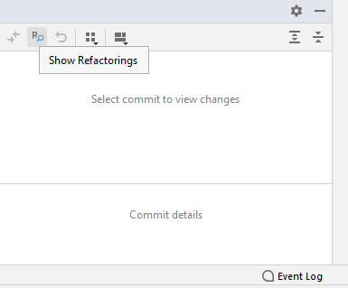
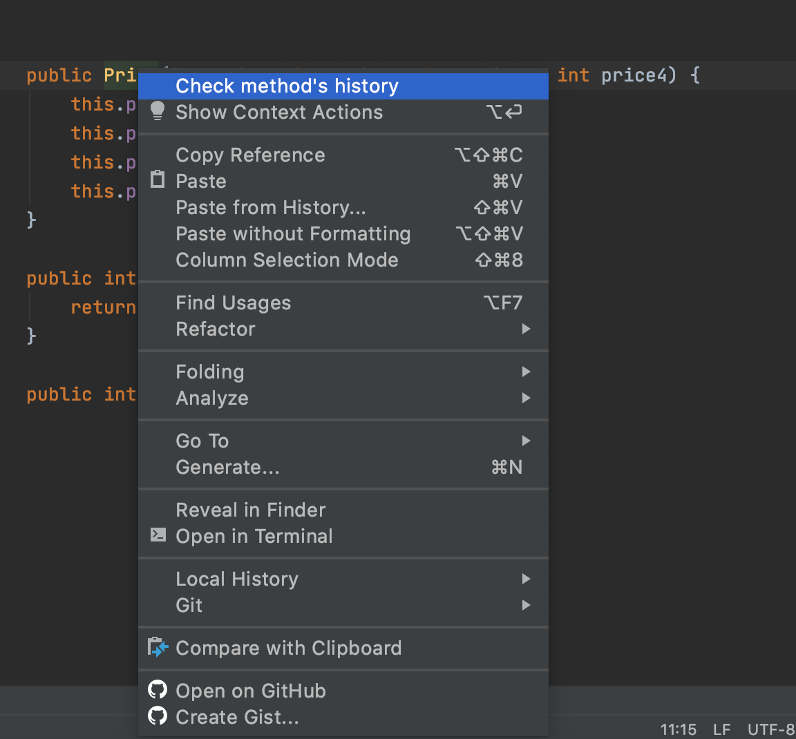

# Detecting Refactorings in Code Changes

How to build
-------------

Download or clone the project in IntelliJ IDEA 2020.1 or up and run `gradle build` in order to install all the required dependencies.
Use `gradle runIde` task to run the project. 
A new IDE will open up where you can follow the steps below.

In order to see the refactorings in a git repository, make sure you cloned the repository and 
open the built-in Git tab in IntelliJ. On the left side, you will see a button as highlighted below.

Click on a commit and then on the Refactorings button to see the refactorings detected in that commit. 

In order to see the refactoring history of a method, right-click on the method signature as below.

Click on 'Check method's history' in order to see the refactorings for that method.

