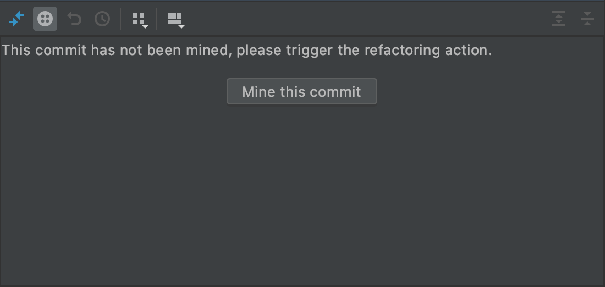

# Detecting Refactorings in Code Changes

This project aims to introduce a plugin for IntelliJ IDEA that detects code refactorings in the version control history of Java repositories. 
The main framework that is used in order to retrieve the refactorings is the RefactoringMiner API.

Every sprint planning and retrospective can be found in the [Milestones section](https://gitlab.ewi.tudelft.nl/cse2000-software-project/2019-2020-q4/cluster-0/detecting-refactorings-in-code-changes/detecting-refactorings-in-code-changes/-/milestones?sort=due_date_desc&state=all). 

How to build & run
-------------

Download or clone the project in IntelliJ IDEA 2020.1 or up and run `gradle build` in order to install all the required dependencies.
Use `gradle runIde` task to run the project. 
A new IDE will open up where you can follow the steps below.
If you want to import the plugin from disk, after building, run `gradle buildPlugin`. A zip will be generated in the 
build/distribution file of the repository. Go to IntelliJ -> Preferences -> Plugin -> Install Plugin
from Disk and upload the zip file. After an IDE restart, you will be able to follow the steps below.

In order to see the refactorings in a git repository, make sure you cloned the repository and 
open the built-in Git tab in IntelliJ. On the left side, you will see a button as highlighted below.

Click on a commit and then on the Refactorings button presented above to see the refactorings detected in that commit. 

In order to see the refactoring history of a method, right-click on the method signature as below.

Click on 'Check Refactoring History' in order to see the refactorings for that method.

If the label `This commit has not been mined` is shown for every commit as below, click on Refactorings
in the main Tools menu. This means that no git repository changed event was triggered, and the commits were not mined.

